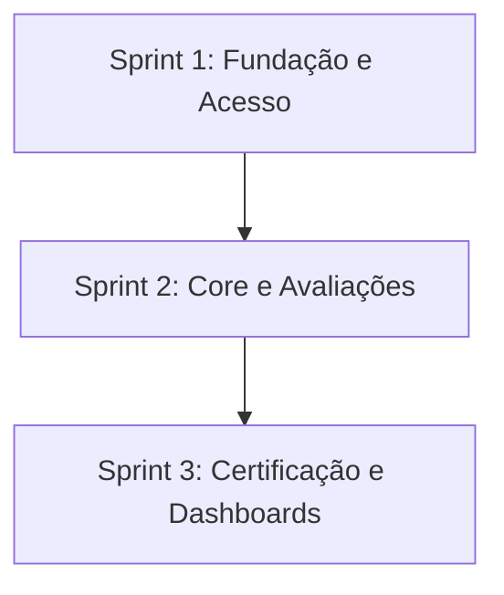

# Portal de Certificação em Metodologias Ágeis (SCRUM)

## 📌 Descrição do Desafio

O aprendizado de metodologias ágeis, especialmente o framework Scrum, é um pilar fundamental na formação de desenvolvedores de software. No entanto, os estudantes frequentemente enfrentam dificuldades para consolidar conceitos teóricos como papéis, rituais e artefatos, além de sentirem falta de uma forma estruturada para medir sua evolução.

**A Dor:** A ausência de uma ferramenta prática que permita validar o conhecimento de forma gamificada e progressiva. Este portal resolve essa lacuna ao oferecer um ambiente de certificação interna por níveis, integrando tecnologias web modernas e persistência de dados.

---

### 🎯 Requisitos Funcionais (RF)

| ID                              | Descrição                                                                                     |
| :------------------------------ | :-------------------------------------------------------------------------------------------- |
| <span id="rf01">**RF01**</span> | Cadastro de usuário utilizando CPF (como identificador único), nome completo, e-mail e senha. |
| <span id="rf02">**RF02**</span> | Login realizado exclusivamente por meio de CPF e senha.                                       |
| <span id="rf03">**RF03**</span> | Seleção aleatória de 10 questões a partir de um banco com 30 daquele nível.                   |
| <span id="rf04">**RF04**</span> | Classificação de questões em três graus: fáceis, médias e difíceis.                           |
| <span id="rf05">**RF05**</span> | Avaliação composta por 3 questões fáceis, 4 médias e 3 difíceis.                              |
| <span id="rf06">**RF06**</span> | Limite de no máximo 2 tentativas por nível.                                                   |
| <span id="rf07">**RF07**</span> | Nota final do nível definida pela maior nota entre as tentativas.                             |
| <span id="rf08">**RF08**</span> | Resultado final calculado como a média das notas finais de cada nível.                        |
| <span id="rf09">**RF09**</span> | Emissão de certificado com nome, CPF, e-mail, data e média final.                             |
| <span id="rf10">**RF10**</span> | Histórico de tentativas (data/hora, pontuação, questões sorteadas) para auditoria.            |
| <span id="rf11">**RF11**</span> | Consulta de progresso (níveis concluídos, tentativas restantes, melhor nota).                 |

### ⚙️ Requisitos Não Funcionais (RNF)

| ID                                | Descrição                                                              |
| :-------------------------------- | :--------------------------------------------------------------------- |
| <span id="rnf01">**RNF01**</span> | Interface simples, clara e responsiva (mobile-friendly).               |
| <span id="rnf02">**RNF02**</span> | Tempo de resposta adequado para carregamento e registro.               |
| <span id="rnf03">**RNF03**</span> | Tratamento de dados pessoais em conformidade com a LGPD.               |
| <span id="rnf04">**RNF04**</span> | Segurança contra fraudes: validações feitas no back-end.               |
| <span id="rnf05">**RNF05**</span> | Adoção de práticas ágeis (backlog, sprints, versionamento, DoD).       |
| <span id="rnf06">**RNF06**</span> | Documentação mínima: modelo de dados, instruções e descrição de rotas. |

### 🚫 Restrições de Projeto (RP)

| ID                              | Descrição                                                                |
| :------------------------------ | :----------------------------------------------------------------------- |
| <span id="rp01">**RP01**</span> | Front-end em HTML, CSS e JavaScript puros (sem frameworks).              |
| <span id="rp02">**RP02**</span> | Banco de dados PostgreSQL com uso explícito de DDL e DML.                |
| <span id="rp03">**RP03**</span> | Back-end em Node.js para comunicação com banco e exposição de APIs.      |
| <span id="rp04">**RP04**</span> | Persistência obrigatória de usuários, questões, tentativas e resultados. |
| <span id="rp05">**RP05**</span> | Foco na entrega de um MVP funcional dentro do semestre.                  |

---

## 📋 Backlog de Produto

O backlog foi organizado para atender aos requisitos funcionais (RF) e não funcionais (RNF) priorizando um MVP funcional.

|    ID    | User Story                                                                                                                                                       |                    Requisitos Relacionados                     | Sprint | Check |
| :------: | ---------------------------------------------------------------------------------------------------------------------------------------------------------------- | :------------------------------------------------------------: | :----: | :---: |
| **US00** | Infraestrutura, Banco de Dados e Documentação Técnica                                                                                                            | [RNF05](#rnf05), [RNF06](#rnf06), [RP02](#rp02), [RP04](#rp04) |   1    | ✅🚧  |
| **US01** | **Cadastro de Usuário**: Como novo usuário, quero me cadastrar no portal fornecendo CPF, nome, e-mail e senha para acessar as avaliações.                        |                 [RF01](#rf01), [RNF03](#rnf03)                 |   1    |  ✅   |
| **US02** | **Autenticação Segura**: Como usuário cadastrado, quero realizar login com CPF e senha para manter meu progresso salvo.                                          |                 [RF02](#rf02), [RNF04](#rnf04)                 |   1    |  ✅   |
| **US04** | **Realização de Avaliação por Nível**: Como usuário, quero realizar provas de 10 questões (com mix de dificuldades) para validar meu conhecimento em cada nível. |          [RF03](#rf03), [RF04](#rf04), [RF05](#rf05)           |   2    |  ✅   |
| **US05** | **Gestão de Tentativas e Notas**: Como usuário, quero ter até 2 tentativas por nível, com o sistema retendo minha melhor nota para o cálculo final.              |          [RF06](#rf06), [RF07](#rf07), [RF08](#rf08)           |   2    |  ✅   |
| **US07** | **Auditoria de Histórico**: Como sistema, devo registrar a data/hora e questões de cada tentativa para fins de auditoria.                                        |                         [RF10](#rf10)                          |   2    |  ✅   |
| **US03** | **Visualização de Progresso**: Como estudante, quero consultar meu progresso, níveis concluídos e notas para saber quanto falta para minha certificação.         |                 [RF11](#rf11), [RNF01](#rnf01)                 |   3    |       |
| **US06** | **Emissão de Certificado**: Como usuário aprovado, quero gerar um certificado em PDF com meus dados e média final para comprovar minha competência.              |                         [RF09](#rf09)                          |   3    |       |

---

## ⏳ Cronograma de Evolução

O projeto é desenvolvido em ciclos de 3 semanas, conforme o cronograma oficial.



### Tabela Descritiva das Sprints

|             Período              |            Documentação da Sprint            |                   Vídeo                   |
| :------------------------------: | :------------------------------------------: | :---------------------------------------: |
| **Sprint 1:** 13/04 a 30/04/2026 | [Sprint Review](./docs/sprint-1/sprint-1.md) | [▶ YouTube](https://youtu.be/stGfCEhU9n4) |
| **Sprint 2:** 04/05 a 21/05/2026 | [Sprint Review](./docs/sprint-2/sprint-2.md) | [▶ YouTube](https://youtu.be/FIshcp9V2EM) |
| **Sprint 3:** 25/05 a 11/06/2026 | [Sprint Review](./docs/sprint-3/sprint-3.md) |                    🔜                     |

---

## 📑 Gestão Scrum

- [**Sprint Planning**](https://github.com/TeamStacked/PortalScrum/issues?q=is%3Aissue+label%3Aplanning)
- [**Daily Meetings**](https://github.com/TeamStacked/PortalScrum/issues?q=is%3Aissue+label%3Adaily)
- [**Sprint Retrospectives**](https://github.com/TeamStacked/PortalScrum/issues?q=is%3Aissue%20label%3Aretrospective)

---

## 🛠️ Tecnologias Utilizadas

O projeto respeita as restrições técnicas de não utilizar frameworks no front-end e garantir persistência robusta:

- **Front-end:** HTML5, CSS3 e JavaScript (Puro/Vanilla).
- **Back-end:** Node.js para exposição de APIs.
- **Banco de Dados:** PostgreSQL (Uso de DDL e DML explícitos).
- **Segurança:** Autenticação via JWT e criptografia de senhas com bcryptjs.
- **Design:** [Figma (Protótipo v3.0)](https://www.figma.com/design/0bTrNLRC1tZpu0w7mzCNjs/Sem-t%C3%ADtulo?node-id=0-1&t=t5hZpchIfgTqTZC2-1) para prototipação e Astah para diagramação UML.

---

## 📂 Estrutura do Projeto

A organização segue o padrão de camadas para garantir separação de responsabilidades e facilitar a manutenção:

```bash
├── src/
│   ├── database/       # Configuração e conexão com PostgreSQL (db.js)
│   ├── infra/          # Automação de schema e carga inicial (scripts SQL)
│   ├── middlewares/    # Filtros de requisição e validação de JWT
│   ├── repositories/   # Camada de persistência (Queries SQL puras)
│   ├── routes/         # Definição de rotas e exposição de endpoints
│   ├── utils/          # Helpers (Criptografia, geradores de token)
│   └── server.js       # Inicialização do servidor Express
├── public/             # Assets estáticos: HTML, CSS e JavaScript Vanilla
├── docs/               # Documentos de processo (DoR, DoD) e Modelagem
├── .env.example        # Modelo de variáveis de ambiente
└── README.md
```

--- -->

## 🚀 Como Executar o Projeto

### Pré-requisitos

- Node.js instalado.
- Banco de Dados PostgreSQL ativo e configurado.

### Instalação e Inicialização

1. Clone o repositório e instale as dependências:
   ```bash
   npm i
   ```
2. Configure o arquivo `.env` na raiz do projeto seguindo o modelo:
   ```env
   PORT=3000
   POSTGRES_HOST=localhost
   POSTGRES_USER=seu_usuario
   POSTGRES_PASSWORD=sua_senha
   POSTGRES_DB=abp
   POSTGRES_PORT=5432
   JWT_SECRET=sua_chave_secreta
   DEFAULT_EXPIRES_IN_SECONDS=1800
   ```
3. Inicialize as tabelas do banco de dados e a carga de dados inicial:
   ```bash
   npm run db:init
   ```
   #### Carga manual do seed (caso o `db:init` falhe por permissão)

Se o comando `npm run db:init` retornar erro de permissão no `COPY`, execute via psql:

```bash
& "C:\Program Files\PostgreSQL\15\bin\psql.exe" -U postgres -d abp -c "\copy public.modulos (id_modulo, titulo) FROM '<caminho_do_projeto>/src/infra/init/seed-data/modulos.csv' WITH (FORMAT csv, HEADER true, DELIMITER ';', ENCODING 'UTF8')"

& "C:\Program Files\PostgreSQL\15\bin\psql.exe" -U postgres -d abp -c "\copy public.questoes (id_questao, id_modulo, grupo, numero, dificuldade, enunciado, alternativa_correta, alternativa_a, alternativa_b, alternativa_c, alternativa_d, imagem) FROM '<caminho_do_projeto>/src/infra/init/seed-data/questoes.csv' WITH (FORMAT csv, HEADER true, DELIMITER ';', ENCODING 'UTF8')"
```

> **Atenção:** substitua `<caminho_do_projeto>` pelo caminho absoluto da pasta do projeto na sua máquina.
> Exemplo: `C:/Users/SEU_USUARIO/Desktop/PortalScrum`

Para verificar se o seed foi carregado corretamente, execute o script:

```bash
src/infra/init/verify_seed.sql
```
```bash
src/infra/init/verify_seed.sql
```
4. Execute o servidor:
   ```bash
   npm run dev
   ```

---

## 👥 Equipe

<body>
   <div align="center">
      <table>
         <thead>
            <th>Scrum Master</th>
            <th>Product Owner</th>
            <th>Dev Team</th>
            <th>Dev Team</th>
            <th>Dev Team</th>
            <th>Dev Team</th>
         </thead>
         <tbody>
            <tr>
               <th><a href="https://github.com/michelrubens"></a></th>
               <th><a href="https://github.com/phjsilva"></a></th>
               <th><a href="https://github.com/portug4lucas"></a></th>
               <th><a href="https://github.com/ThiagoDT"></a></th>
               <th><a href="https://github.com/Victorhubb"></a></th>
               <th><a href="https://github.com/ViniciusGuin"></a></th>
            </tr>
            <tr>
               <th><a href="https://www.linkedin.com/in/michelrubens"></a></th>
               <th><a href="http://www.linkedin.com/in/pedro-silva-3b5869380"></a></th>
               <th><a href="http://www.linkedin.com/in/lucas-portugal-09263b362"></a></th>
               <th></th>
               <th><a href="https://www.linkedin.com/in/victor-gomes-699051404/"></a></th>
               <th></th>
            </tr>
         </tbody>
      </table>
   </div>
</body>

## 📝 Padrão de Commits e Branches

Para garantir a rastreabilidade com o **GitHub Projects** e as **Issues**, adotamos os seguintes padrões:

### Commits

As mensagens devem referenciar o ID da Issue com `#`:

- `tipo (#id_issue): descrição clara`
- _Exemplo:_ `feat (#1): implementar hash de senha no cadastro`

### Branches

As branches devem ser criadas a partir de uma Issue:

- `tipo/id_issue-descrição-breve`
- _Exemplo:_ `feat/1-hash-senha`

**Tipos permitidos:**

| Tipo           | Descrição                                                              |
| :------------- | :--------------------------------------------------------------------- |
| **`feat`**     | Adição de um novo recurso ou funcionalidade.                           |
| **`fix`**      | Correção de um erro ou bug.                                            |
| **`docs`**     | Alterações apenas na documentação (ex: README).                        |
| **`style`**    | Ajustes de formatação, lint, pontos e vírgulas, etc.                   |
| **`refactor`** | Mudanças no código que não alteram a funcionalidade (ex: performance). |
| **`test`**     | Criação, alteração ou exclusão de testes unitários.                    |
| **`chore`**    | Mudanças em build, configurações, pacotes ou `.gitignore`.             |
| **`cleanup`**  | Limpeza de código (remover comentários ou trechos inúteis).            |
| **`remove`**   | Exclusão de arquivos, diretórios ou funções obsoletas.                 |

---

### 🔗 Links Importantes

- [Pasta de Documentação](./docs) (Contém Checklists de DoR/DoD).
